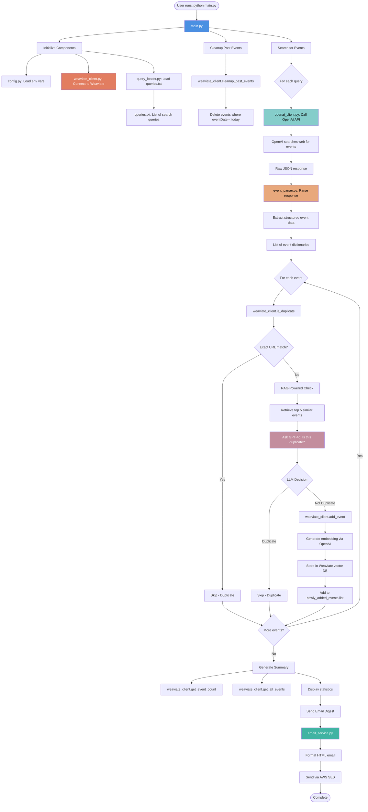
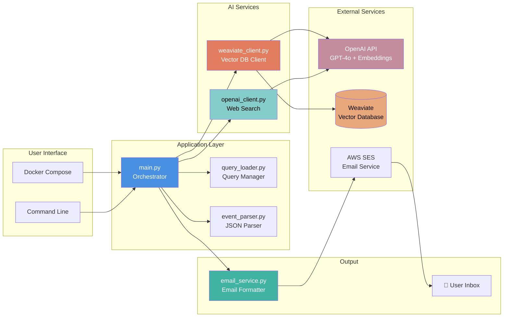
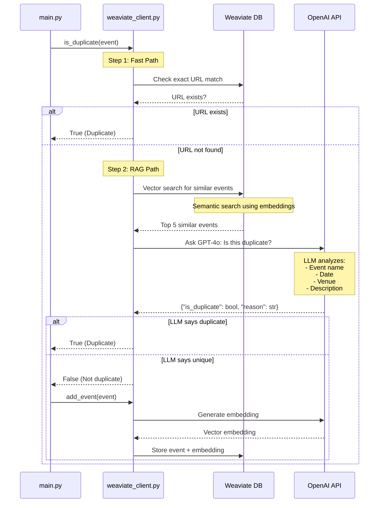
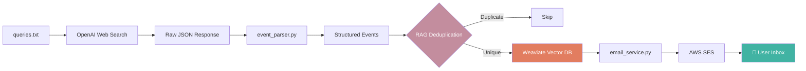
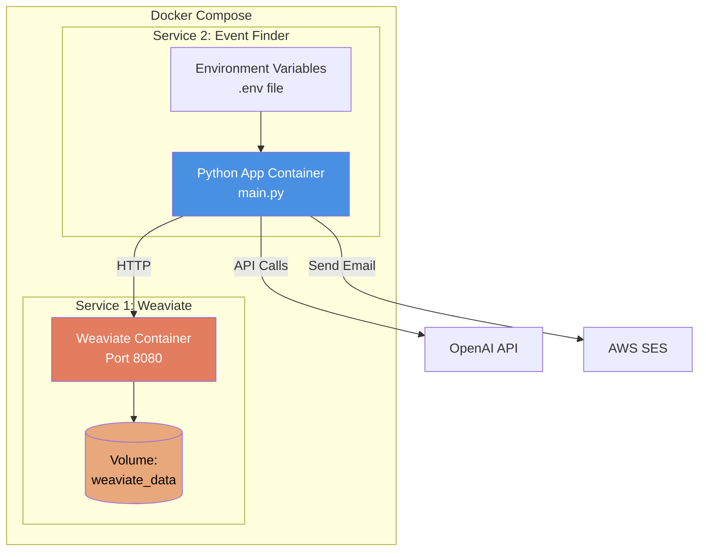
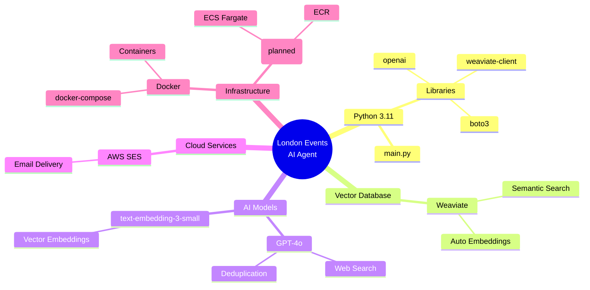

# 🏗️ System Architecture & Process Flow

This document provides a visual overview of how the London Events AI Agent works.

---

## 🔄 Complete Process Flow

---

## 📦 Component Architecture

---

## 🔍 RAG Deduplication Flow

---

## 📊 Data Flow

---

## 🐳 Docker Architecture

---

## 🔑 Key File Responsibilities

| File | Purpose | Input | Output |
|------|---------|-------|--------|
| **main.py** | Orchestrates entire process | queries.txt | Email digest |
| **config.py** | Loads environment variables | .env file | Configuration constants |
| **query_loader.py** | Manages search queries | queries.txt | List of queries |
| **openai_client.py** | Calls OpenAI for web search | Search query | Raw JSON events |
| **event_parser.py** | Parses & validates events | Raw JSON | Structured dicts |
| **weaviate_client.py** | Vector DB operations | Events | Stored/retrieved events |
| **email_service.py** | Sends email digests | Event list | Sent email |
| **rag_query.py** | Interactive CLI queries | User question | AI answer |

---

## 🎯 Technology Stack

---

For detailed code examples and step-by-step explanations, see [PROCESS_FLOW.md](./PROCESS_FLOW.md).

