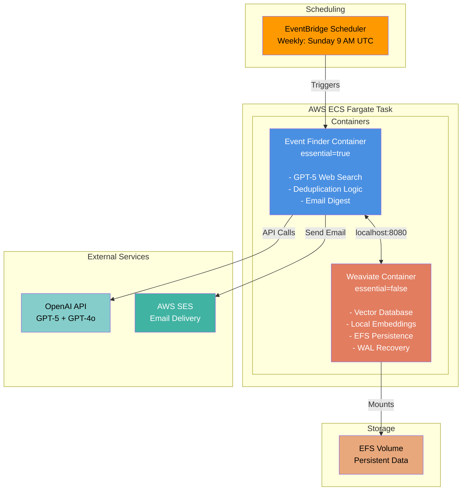

# Event Discovery RAG Pipeline

An automated event discovery system that combines LLM-powered web search with vector database deduplication, deployed as a serverless pipeline on AWS.

## Overview

This project implements a production-grade RAG (Retrieval-Augmented Generation) pipeline that discovers London-based events through intelligent web search and maintains a deduplicated knowledge base using semantic similarity. The system runs on a scheduled basis, searching for events matching user-defined queries and delivering personalized email digests.

## Architecture

The pipeline consists of three main components:

1. **Agentic Search Layer**: OpenAI's GPT-5 reasoning model with web search capabilities performs multi-step searches across event platforms
2. **Vector Storage & Deduplication**: Weaviate vector database with local embeddings (all-MiniLM-L6-v2) for semantic similarity matching
3. **Orchestration**: AWS ECS Fargate with EventBridge scheduling for serverless execution



## Technical Stack

### Core Technologies
- **Python 3.11**: Application runtime
- **OpenAI GPT-5**: Reasoning model with agentic web search capabilities
- **Weaviate 1.27.5**: Vector database for semantic search and storage
- **Sentence Transformers**: Local embedding generation (all-MiniLM-L6-v2, 384 dimensions)

### AWS Infrastructure
- **ECS Fargate**: Serverless container orchestration
- **EventBridge Scheduler**: Cron-based task scheduling
- **ECR**: Container image registry
- **EFS**: Persistent storage for vector database
- **SES**: Transactional email delivery
- **VPC**: Network isolation with public subnets

### Infrastructure as Code
- **Terraform**: Complete infrastructure provisioning
- **GitHub Actions**: CI/CD pipeline with path-based filtering
- **Docker**: Multi-stage containerization with layer caching

## Key Features

### Intelligent Event Discovery
The system uses OpenAI's Responses API with the `web_search` tool, enabling the LLM to autonomously:
- Perform multi-step searches across event platforms (Eventbrite, Meetup, Luma)
- Cross-reference information from multiple sources
- Verify event details and filter by date constraints
- Extract structured data (name, date, venue, pricing, speakers)

### RAG-Powered Deduplication
Duplicate detection combines vector similarity with LLM reasoning:

1. **Fast Path**: Exact URL matching for immediate duplicate detection
2. **Semantic Search**: Local embeddings generate 384-dimensional vectors for each event
3. **Candidate Retrieval**: Vector similarity search (cosine distance, 0.85 threshold) retrieves top 5 similar events
4. **LLM Decision**: GPT-4o analyzes retrieved candidates and makes final duplicate determination based on event name, date, venue, and description

This hybrid approach achieves higher accuracy than threshold-based similarity alone, correctly distinguishing between recurring events, similar topics, and true duplicates.

### Serverless Architecture
The pipeline is designed for cost-effective, scheduled execution:

- **On-Demand Execution**: Runs weekly via EventBridge, no idle compute costs
- **Container Lifecycle Management**: Event finder container controls task termination (essential=true), Weaviate sidecar shuts down automatically
- **Persistent Storage**: EFS-backed Weaviate with Write-Ahead-Log ensures data durability across executions
- **Graceful Shutdown**: 30-second SIGTERM grace period allows WAL flush before container termination

### Production Optimizations

**Docker Image Optimization**:
- Pre-downloaded embedding model in build stage (saves 30-60s startup time)
- Layer caching for dependencies
- Slim base image (Python 3.11-slim)

**CI/CD Efficiency**:
- Path-based workflow filtering (skips builds for documentation/Terraform changes)
- Automated ECR push on code changes
- GitHub Actions integration with AWS OIDC

**Cost Management**:
- 7-day CloudWatch log retention
- Automatic cleanup of past events
- Local embeddings (no OpenAI embedding API costs)

## How It Works

### Execution Flow

1. **Initialization**
   - ECS task starts both containers (Weaviate + Event Finder)
   - Event Finder waits for Weaviate health check
   - Local embedding model loads from pre-cached image layer

2. **Event Discovery**
   - Load search queries from `queries.txt`
   - For each query, GPT-5 performs agentic web search
   - Parse structured JSON responses into event objects

3. **Deduplication**
   - Generate embedding for new event (name + description + type + venue)
   - Check for exact URL match (fast path)
   - Perform vector similarity search for semantic duplicates
   - LLM analyzes top candidates and makes final decision

4. **Storage & Notification**
   - Store new events in Weaviate with vectors
   - Compile email digest of new events
   - Send via AWS SES
   - Clean up past events (date < today)

5. **Shutdown**
   - Event Finder container exits (essential=true)
   - ECS sends SIGTERM to Weaviate
   - Weaviate flushes WAL to EFS (30s grace period)
   - Task terminates, EFS persists data for next run

### Data Persistence

Weaviate uses a Write-Ahead-Log (WAL) strategy for crash recovery:
- Every write is immediately persisted to WAL on EFS
- Acknowledgment only sent after WAL entry is written
- On startup, incomplete WAL entries are replayed
- Periodic segment flushing consolidates WAL into optimized storage

This ensures no data loss even with immediate container shutdown.

## Project Structure

```
.
├── main.py                    # Orchestration logic
├── openai_client.py           # GPT-5 agentic search client
├── weaviate_client.py         # Vector database operations
├── event_parser.py            # JSON response parsing
├── email_service.py           # AWS SES integration
├── config.py                  # Configuration and prompts
├── queries.txt                # Search queries (one per line)
├── requirements.txt           # Python dependencies
├── Dockerfile                 # Container definition
├── docker-compose.yml         # Local development setup
├── terraform/                 # Infrastructure as Code
│   ├── main.tf               # Root module
│   ├── modules/
│   │   ├── ecs/              # ECS cluster, task definition
│   │   ├── ecr/              # Container registry
│   │   ├── efs/              # Persistent storage
│   │   ├── scheduler/        # EventBridge scheduling
│   │   └── ses/              # Email service
│   └── variables.tf          # Configuration variables
└── .github/workflows/
    └── deploy.yml            # CI/CD pipeline
```

## Configuration

### Environment Variables

Required for production deployment:
```bash
OPENAI_API_KEY          # OpenAI API key
AWS_REGION              # AWS region (default: eu-west-1)
SES_FROM_EMAIL          # Verified sender email
SES_TO_EMAIL            # Recipient email
WEAVIATE_HOST           # Weaviate hostname (default: localhost)
WEAVIATE_PORT           # Weaviate HTTP port (default: 8080)
WEAVIATE_GRPC_PORT      # Weaviate gRPC port (default: 50051)
```

### Terraform Variables

Key infrastructure settings in `terraform/variables.tf`:
```hcl
schedule_expression     # Cron schedule (default: Sunday 9 AM UTC)
task_cpu               # Fargate CPU units (default: 1024)
task_memory            # Fargate memory MB (default: 2048)
```

## Deployment

### Prerequisites
- AWS account with appropriate permissions
- Terraform >= 1.0
- Docker
- OpenAI API key

### Initial Setup

1. **Configure AWS credentials**:
   ```bash
   aws configure
   ```

2. **Set up Terraform backend** (S3 + DynamoDB for state locking):
   ```bash
   cd terraform
   ./setup-backend.sh
   ```

3. **Configure variables**:
   ```bash
   cp terraform/terraform.tfvars.example terraform/terraform.tfvars
   # Edit terraform.tfvars with your values
   ```

4. **Deploy infrastructure**:
   ```bash
   terraform init
   terraform plan
   terraform apply
   ```

5. **Configure GitHub Actions secrets**:
   - `AWS_ACCESS_KEY_ID`
   - `AWS_SECRET_ACCESS_KEY`
   - `OPENAI_API_KEY`
   - `SES_FROM_EMAIL`
   - `SES_TO_EMAIL`

6. **Push to trigger deployment**:
   ```bash
   git push origin main
   ```

### Local Development

Run the pipeline locally with Docker Compose:

```bash
# Start Weaviate
docker-compose up -d weaviate

# Run event finder
docker-compose up event-finder
```

Or run directly with Python:
```bash
pip install -r requirements.txt
python main.py
```

## Monitoring

### CloudWatch Logs
View execution logs in AWS Console:
```
CloudWatch > Log Groups > /ecs/london-events-task
```

### ECS Task Status
Monitor task execution:
```
ECS > Clusters > london-events-cluster > Tasks
```

### Manual Execution
Trigger immediate run via EventBridge:
```bash
aws scheduler invoke-schedule \
  --name london-events-daily-schedule \
  --region eu-west-1
```

## Cost Estimation

Monthly costs (assuming weekly execution):
- **ECS Fargate**: ~$0.50 (4 runs × 5 min × $0.04048/vCPU-hour)
- **EFS**: ~$0.30 (1 GB × $0.30/GB-month)
- **ECR**: ~$0.10 (1 GB storage)
- **OpenAI API**: ~$2-5 (GPT-5 search + GPT-4o deduplication)
- **AWS SES**: $0.00 (free tier: 62,000 emails/month)

**Total**: ~$3-6/month

## Future Enhancements

- Multi-collection support for different search domains (news, sports, etc.)
- Configurable deduplication strategies per collection
- Web dashboard for event browsing
- Slack/Discord notification integration
- Advanced filtering (price range, event type, venue)

## License

MIT License - see LICENSE file for details


