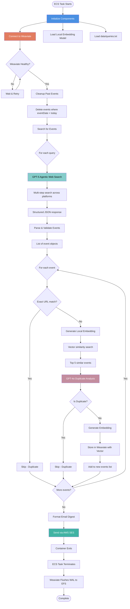
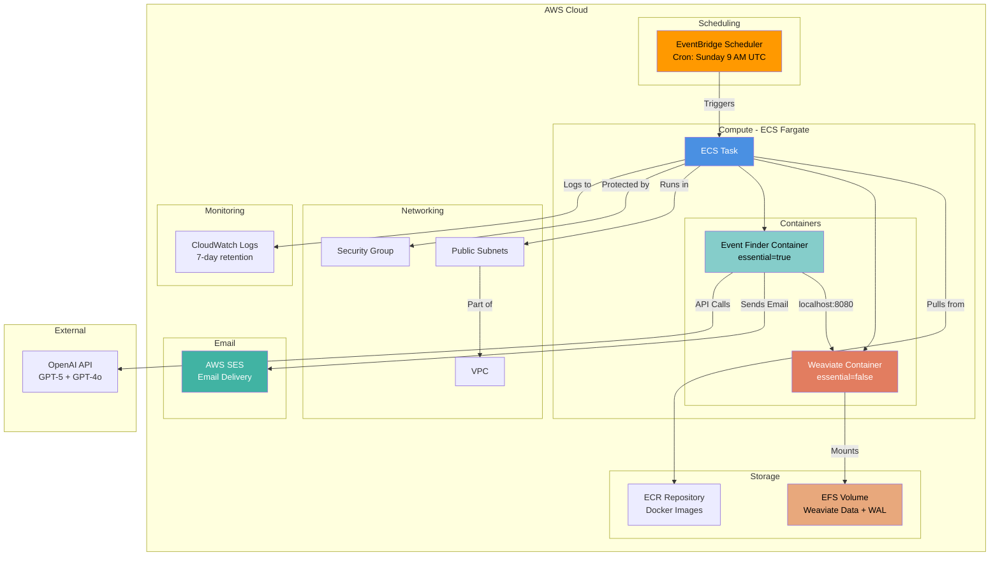
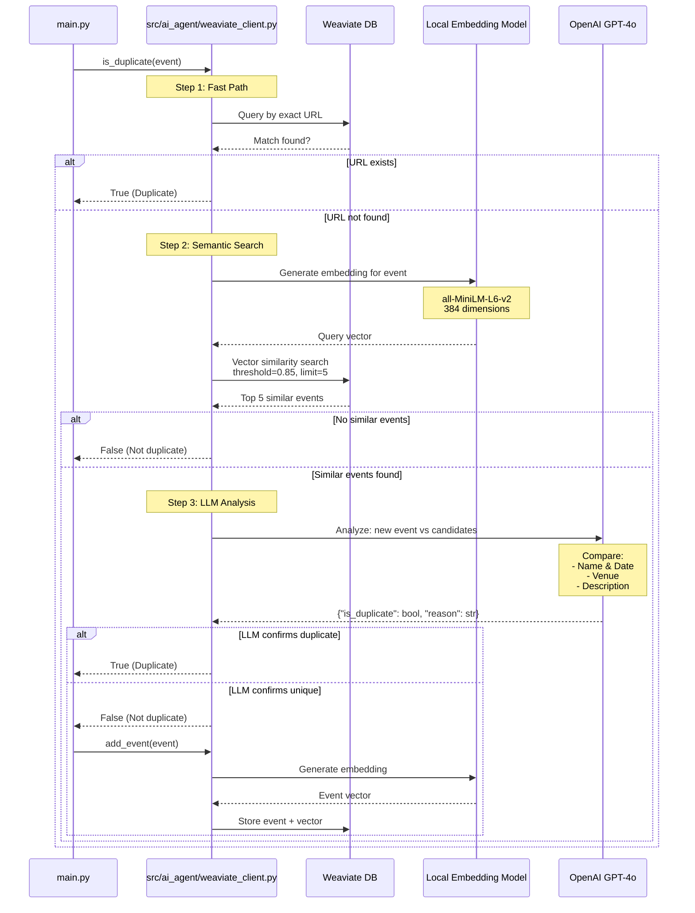
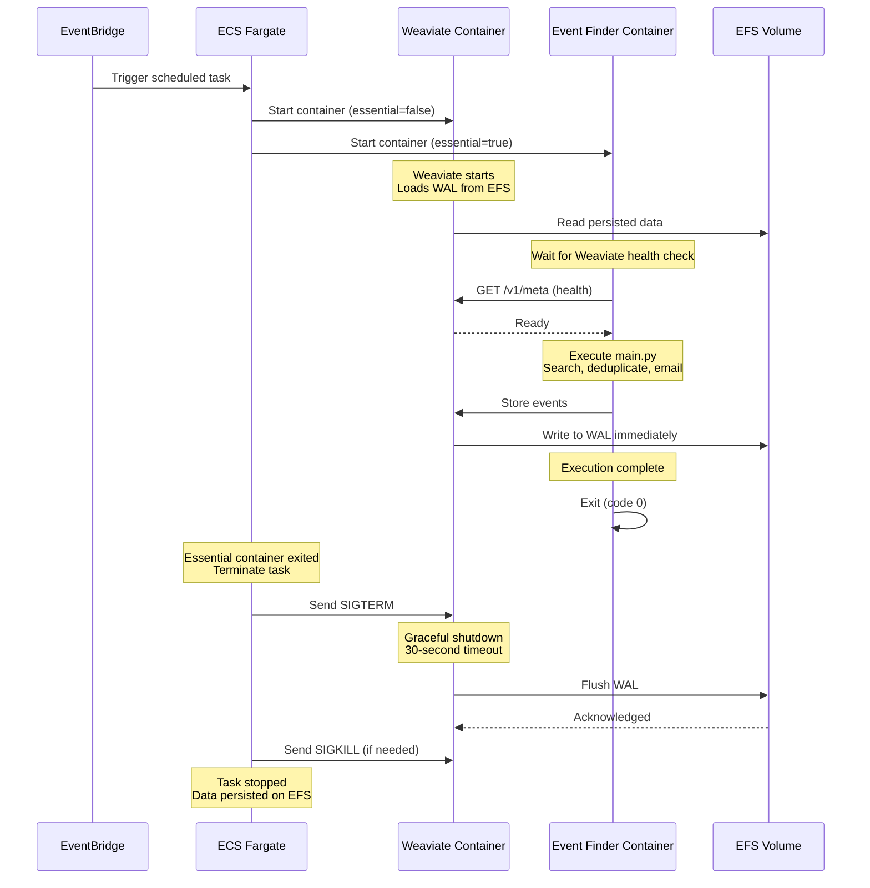
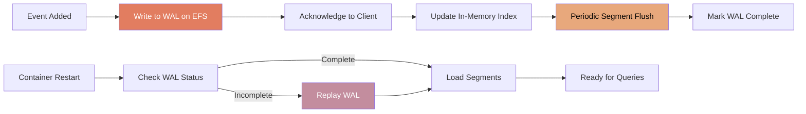

# System Architecture

Technical architecture documentation for the Event Discovery RAG Pipeline.

## AI Model Strategy

The system uses a multi-model approach optimized for different tasks:

| Component | Model | Purpose |
|-----------|-------|---------|
| **Event Discovery** | GPT-5 with web search | Agentic search with reasoning capabilities for multi-step event discovery |
| **Deduplication** | GPT-4o | Fast, cost-effective LLM for semantic duplicate detection |
| **Embeddings** | all-MiniLM-L6-v2 | Local embedding generation (384 dimensions, no API costs) |

This architecture balances cost, performance, and quality by using reasoning models only where needed and eliminating embedding API costs through local generation.

---

## Complete Process Flow

---

## AWS Infrastructure Architecture

---

## RAG Deduplication Flow

---

## Container Lifecycle

---

## Data Persistence Strategy

Weaviate uses a Write-Ahead-Log (WAL) approach for crash recovery:

Key guarantees:
- Every write is persisted to EFS before acknowledgment
- WAL entries are append-only (fast writes)
- Incomplete WAL is replayed on startup
- 30-second SIGTERM grace period ensures final flush

---

## Component Responsibilities

| Component | Purpose | Key Technologies |
|-----------|---------|------------------|
| **main.py** | Orchestration and execution flow | Python, logging |
| **src/ai_agent/openai_client.py** | GPT-5 agentic web search | OpenAI Responses API, web_search tool |
| **src/ai_agent/weaviate_client.py** | Vector database operations | Weaviate v4 API, sentence-transformers |
| **src/ai_agent/event_parser.py** | JSON parsing and validation | Python, data validation |
| **src/ai_agent/email_service.py** | Email digest generation | boto3, AWS SES |
| **src/ai_agent/config.py** | Configuration management | python-dotenv, environment variables |
| **src/ai_agent/query_loader.py** | Query file management | File I/O, text processing |

---

## Technology Stack Summary

**Application Layer**:
- Python 3.11 (runtime)
- OpenAI SDK (GPT-5, GPT-4o)
- Weaviate Client v4 (vector database)
- Sentence Transformers (local embeddings)
- boto3 (AWS SDK)

**Infrastructure**:
- AWS ECS Fargate (serverless containers)
- AWS EventBridge (scheduling)
- AWS ECR (container registry)
- AWS EFS (persistent storage)
- AWS SES (email delivery)
- Terraform (infrastructure as code)
- GitHub Actions (CI/CD)

**Data & AI**:
- Weaviate 1.27.5 (vector database)
- all-MiniLM-L6-v2 (embedding model, 384 dimensions)
- GPT-5 with web search (event discovery)
- GPT-4o (deduplication)

---

For detailed process flow documentation, see [PROCESS_FLOW.md](./PROCESS_FLOW.md).
